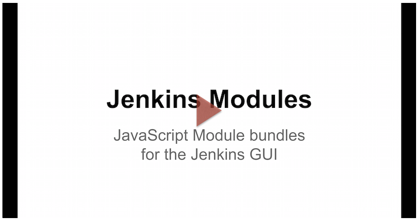

This is a JavaScript "module bundle" loader for Jenkins ([NPM] package) i.e. a loader for loading a JavaScript file that contains one or more
[CommonJS]/[node.js] style modules in a single HTTP request (i.e. a "bundle").

 
Install Package:

```
npm install --save jenkins-js-modules
```
__Table of Contents__:
<p>
<ul>
    <a href="#problem--motivation">Problem / Motivation</a><br/>
    <a href="https://github.com/tfennelly/jenkins-js-modules/blob/master/FAQs.md#do-i-really-need-to-learn-all-this-new-stuff">Do I really need to learn all this "new" stuff?</a><br/>
    <a href="#about-jenkins-modules">About Jenkins Modules</a><br/>
    <a href="#support-modules">Support Modules</a><br/>
    <a href="#framework-libs-jenkinscijs-libs">Framework Libs (jenkinsci/js-libs)</a><br/>
    <a href="https://github.com/tfennelly/jenkins-js-modules/issues">Enhancement/Issue Tracking</a><br/>
    <a href="FAQs.md">FAQs</a><br/>
</ul>    
</p>

<hr/>
 
# Problem / Motivation
For the most part, the Jenkins GUI is constructed on the server side from [Jelly] files ([Stapler] etc). Client-side
JavaScript has not played a big part in the Jenkins GUI.

If the Jenkins GUI is to be modernized and improved (from a user experience perspective), client-side JavaScript
needs to be able to play a bigger part. If that's so, we need to modernize/improve the development patterns around how
JavaScript is currently used in Jenkins.

As we see it, the main issues today are:

1. __Modularity__: Jenkins currently has no concept of modularity when it comes to the JavaScript code used in the GUI. All of the JavaScript is concentrated mainly in a single JavaScript file i.e. `hudson-behaviour.js`.
1. __Anti-Patterns__: Too much JavaScript code is bound into the global scope, creating a litany of well known issues.
1. __Testability__: Not easy to write JavaScript unit tests. The only way JavaScript is tested is via `JenkinsRule` (HtmlUnit and it's `WebClient`).
1. __Multiple versions of Framework Libraries__: One version of Prototype/jQuery doesn’t fit all. We need a way of supporting multiple versions of the same library (e.g. jQuery) in a way that works in the browser, "detached" from the global scope. We need to be able to introduce new versions of libraries (and deprecate old versions) in an orderly fashion.
 
These are the problems that `jenkins-js-modules` (this [NPM] package) is targeted at helping to solve.

It is hoped that `jenkins-js-modules` will help those that are interested (see next section) in maintaining __modular__,
__unit testable__, __evolvable__ (see note below) JavaScript code that runs in a more predictable/stable environment that
is more immune to plugin updates etc (e.g. an upgrade to the 
[jQuery plugin](https://wiki.jenkins-ci.org/display/JENKINS/jQuery+Plugin) doesn't break the plugin GUI).
Using [CommonJS] style modularity also makes it possible to __more easily leverage the growing set of publicly available
[NPM]/[node.js] packages__, which is a huge benefit.

> __What do we mean by "evolvable"?__: `jenkins-js-modules` makes it possible to safely run multiple versions of core JavaScript Framework libs on the same page (jQuery, Bootstrap etc). This makes it possible for modular code (built on `jenkins-js-modules`) to depend on an explicit version of a JS lib that is guaranteed to remain available on e.g. plugin upgrades. Conversely, the same modular code can upgrade the version of a lib it depends on without effecting other modular code that still depends on an older version.

# Do I need to learn all this "new" stuff?
No, this is totally optional. [See FAQ](https://github.com/tfennelly/jenkins-js-modules/blob/master/FAQs.md#do-i-really-need-to-learn-all-this-new-stuff)  
  
# About Jenkins Modules

The following slides attempt to bring you through `jenkins-js-modules` in some more detail.
  
<p align="center">
    <a href="https://docs.google.com/presentation/d/1M8sf5zuPgf7osR2Q7wfbkgVs7Es93rYAJTbtwiGfI7E/pub?start=false&loop=false&delayms=10000" target="_blank">
        
    </a>
</p>

> Also check out the <a href="FAQs.md">FAQs</a>.

# Support Modules

The following [NPM] packages are designed to aid the use and adoption of `jenkins-js-modules`:

* [jenkins-js-builder]: See this package for details on how to create module bundles for `jenkins-js-modules`.
* [jenkins-js-test]: See this package for details on how to test modules for module bundles for `jenkins-js-modules`. This package's functionality is indirectly available via [jenkins-js-builder].

# Framework Libs (jenkinsci/js-libs)

> __[Framework libs are located in jenkinsci/js-libs](https://github.com/jenkinsci/js-libs)__.

As stated earlier, using [CommonJS] style modularity makes it possible to more easily leverage the growing set of publicly available
[NPM]/[node.js] packages. If you want to use some really cool [NPM] package that you just found, all you need to do is follow the
"standard" [NPM] package installation process, adding it to your "app" bundle e.g. `npm install --save cool-new-lib`.

This is great, but if followed all the way, your JavaScript "app" bundles will soon become quite heavy for the browser to
load because they will contain all JavaScript required by all the modules in the bundle.

The main feature of `jenkins-js-modules` is it's ability to load module bundles that can `export` / `import` modules to/from
other modules bundles i.e. share common modules between bundles (see above slides). This means we can create `jenkins-js-modules` style 
module bundles for __different versions__ of all of the major JavaScript Framework libs out there (jQuery, Bootstrap etc), making it possible for 
"app" bundles to share common Framework libs and to not have them in their "app" bundle, making them considerably lighter for
browser load and helping to avoid the bundle bloat problem.

We have already created Framework lib bundles for a number of common JavaScript libs (jQuery, Bootstrap and more).

> __[Framework libs are located in jenkinsci/js-libs](https://github.com/jenkinsci/js-libs)__.

[NPM]: https://www.npmjs.com/
[CommonJS]: http://www.commonjs.org/
[node.js]: https://nodejs.org/en/
[Jelly]: https://wiki.jenkins-ci.org/display/JENKINS/Basic+guide+to+Jelly+usage+in+Jenkins
[Stapler]: http://stapler.kohsuke.org/
[jquery-detached]: https://github.com/tfennelly/jquery-detached
[jqueryui-detached]: https://github.com/tfennelly/jqueryui-detached
[jenkins-js-builder]: https://github.com/tfennelly/jenkins-js-builder
[jenkins-js-test]: https://github.com/tfennelly/jenkins-js-test